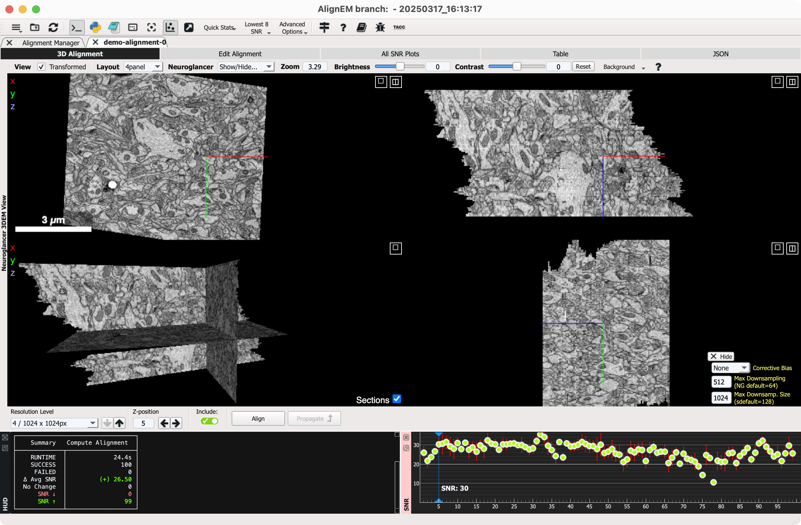

# AlignEM: An Intuitive & Fast GUI for EM Image Registration
The complete commit history for AlignEM is located here: [AlignEM: fb30_joel branch](https://github.com/mcellteam/swift-ir/tree/fb30_joel)

## Linux or macOS (perform steps 1-5 only once):
1. Install conda if it is not already. I recommend the slimmed down [Miniconda installation](https://www.anaconda.com/docs/getting-started/miniconda/install).
2. [Download](https://github.com/joelyancey/AlignEM/archive/refs/heads/main.zip) .zip archive of AlignEM from GitHub.
3. Double click on the .zip archive file to extract
4. In Terminal, change directories to AlignEM-main/, for example: `cd ~/Downloads/AlignEM-main/`
   
   *The AlignEM-main directory contains everything the program needs to run. It can be moved out of Downloads.*

5. (**Linux only**) In Terminal, run from AlignEM-main/: `conda env create -f linux.yml`

   (**macOS only**) In Terminal, run from AlignEM-main/: `conda env create -f macOS.yml`
   
   *It may take several minutes to build the pre-configured alignment environment.*
7. <ins>**Launch AlignEM GUI**</ins>. In Terminal, run from AlignEM-main/:
   
   `conda activate align-env`
   
   `./alignem`
   
   *It may take several minutes for the AlignEM GUI to spool up.*

## Society For Neuroscience Presentation by Joel Yancey

## Screenshots

